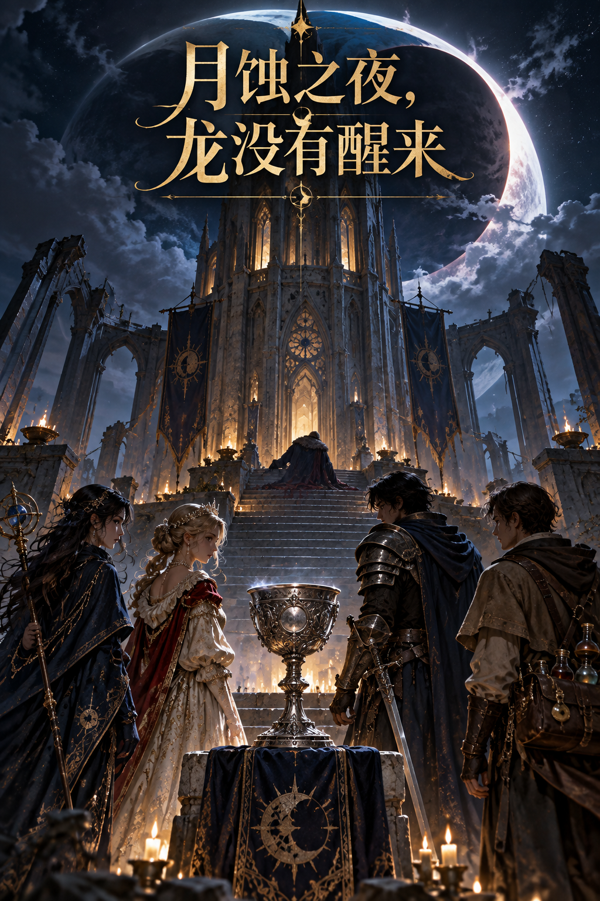

# 月蚀之夜，龙没有醒来

塞勒涅王国的月蚀祭之夜，主持仪式的摄政王死在从内部锁死的祭祀塔顶。四名曾进入塔中的人，各有理由追查真相，也各自身处嫌疑之中。

## 从这里开始

- **玩家：**先读[游玩须知](game/player/play_guide.md)与[公开开场及选角信息](game/player/public_opening.md)，可看[角色展示图](assets/characters.png)。选定角色后，只读主持人发给你的对应私密角色卡。游玩前不要打开其他角色卡或 `game/host/`。
- **主持人：**先读[主持规则：开局分发、每轮核对与危机刻度](game/host/gm_host_rules.md)，再按下面的顺序准备。第一条回复按主持规则向全体玩家发送[游玩须知](game/player/play_guide.md)与[公开开场](game/player/public_opening.md)的可点击链接；选角后，分别发放各自的角色卡。不要向玩家发送整个文件夹。

## 主持人阅读顺序

1. [主持规则](game/host/gm_host_rules.md)
2. [世界与仪式规则](game/host/gm_world.md)
3. [真相时间线](game/host/gm_timeline.md)
4. [人物动机](game/host/gm_characters.md)
5. [线索与证词](game/host/gm_clues.md)
6. [四人路线与调查运行](game/host/gm_operations.md)
7. [终局分支](game/host/gm_outcomes.md)
8. [终局前提示与收尾](game/host/gm_finale_flow.md)

主持过程中，按触发阶段查阅[人物秘密](game/host/character_reveals/)；玩家误判时查阅[误判路线](game/host/misjudgment_routes.md)。任何结局正文前都先执行终局前提示与收尾，再参考[结局文案](game/host/ending_scripts.md)，按玩家实际选择调整。

四张私密角色卡分别是：[莱恩](game/player/private_leon.md)、[伊芙琳](game/player/private_evelyn.md)、[卡西安](game/player/private_cassian.md)、[莉西亚](game/player/private_lissia.md)。这是一份供主持人获取完整资料的发布包；玩家只应收到自己的角色卡与公开开场。

## 授权

[game/ 下的原创剧本文字采用 CC BY-NC-SA 4.0](LICENSE.md)：允许署名、非商业分享与改编，公开改编须沿用同一许可。商业使用请另行取得作者授权。assets/ 下的 AI 生成图片不包含在此许可中。
